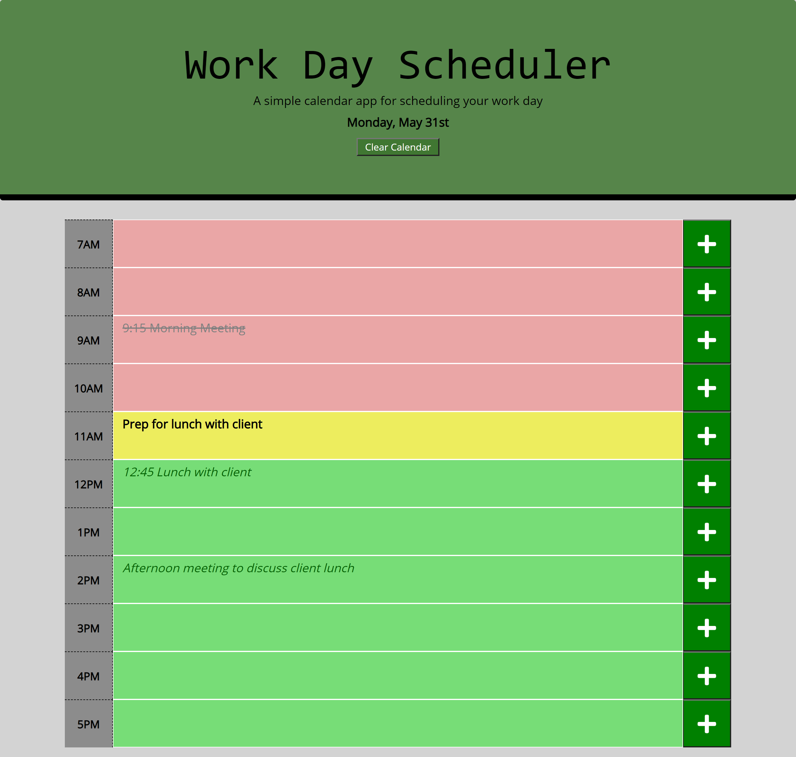

# Work-Day-Scheduler

## Description
For this assignment I was asked to create a work day planner that will diplay today's date at the top of the page. The planner will save tasks that have been entered to localstorage.  The hour rows will change background color to represent past, present and future tasks using moment.js.

## Installation
* The first thing I did was link the bootstrap stylesheets and .js files for moment.js and JQuery as well as the local .css and .js files
* Next I created a table in HTML for the hour rows in my planner
* After I had the rows created in HTML I used CSS to target the classes I created and I styled the page
* When I had it close to how I wanted it I started working on the JavaScript file to link moment.js to display today's date at the top of the page.
* Once I had the date diplaying correctly I created variables for the data entered into the hour rows and used those variables to save the entered data to localstorage
* When I had that data saving to localstorage I targeted each row with a localstorage.getItem to retrieve the data from localstorage until it has been cleared
* Once I had set.Item and get.Item working properly for each row I started working on the past, present, and future row formatting
* I used .split and .parseInt to target the number in the row id and compare it to the current hour of the day with moment.js
* When I had that working correctly I created an if, else if, else statment to add and remove classes to the rows based on the time and format them appropriately
* After all that I created a clear calendar button to allow the user to start with a clean calendar each day

## Technologies Used
* JavaScript
* HTML
* CSS
* Bootstrap
* moment.js
* JQuery
* Git Bash
* GitHub

## Author
* Tyler Davis &nbsp; | &nbsp; [GitHub](https://github.com/Twdavis85)

## Review URL
[GitHub](https://github.com/Twdavis85/Work-Day-Scheduler) &nbsp; | &nbsp; 
[Live](https://twdavis85.github.io/Work-Day-Scheduler/)

#

